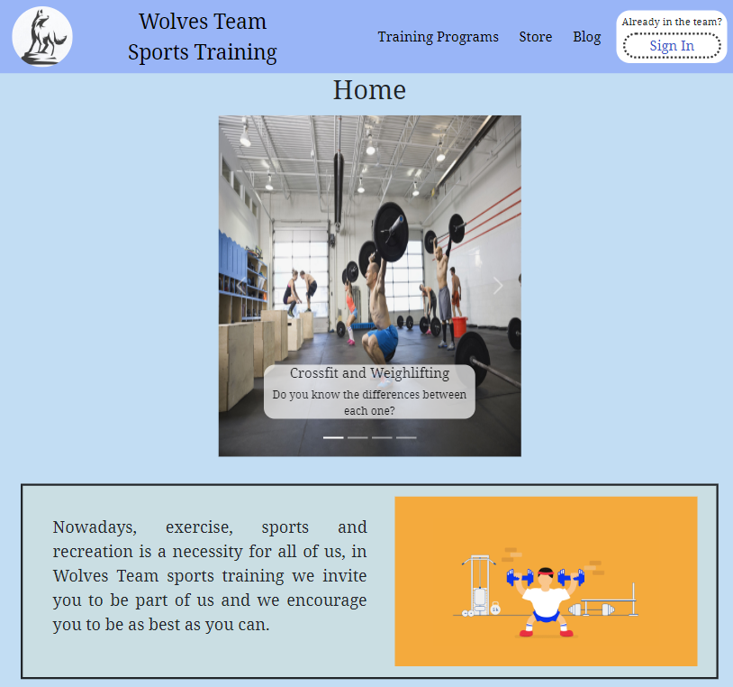
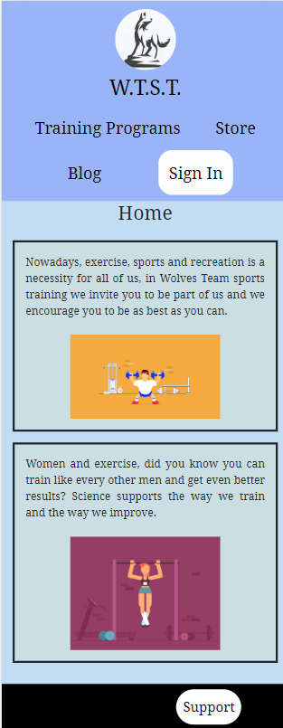
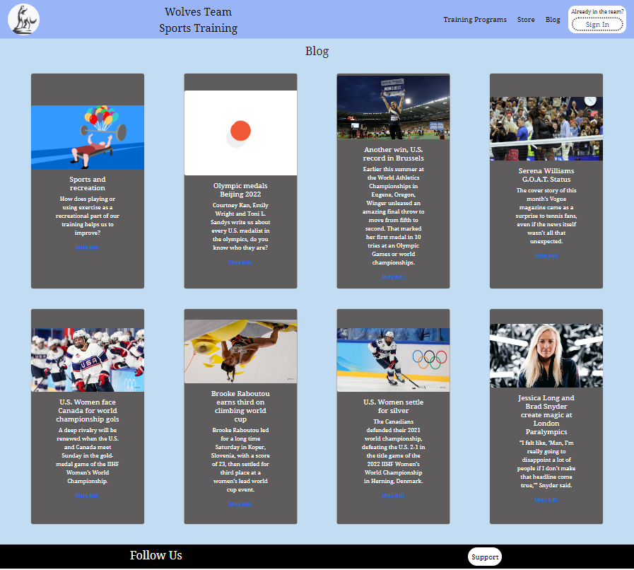
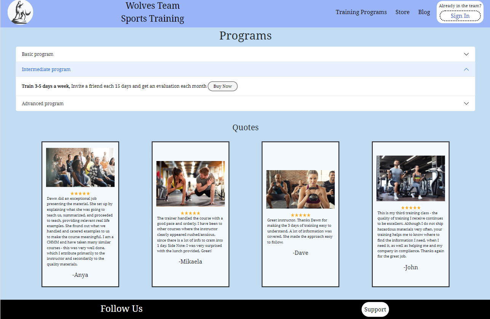
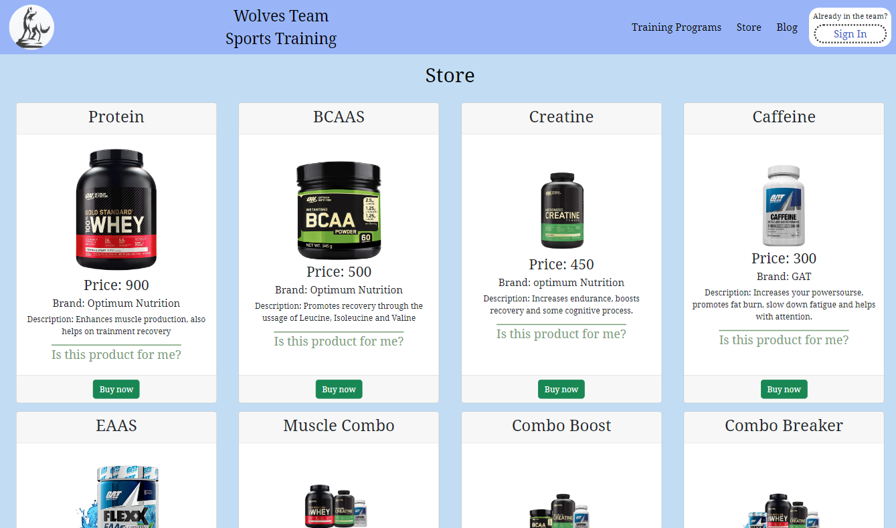
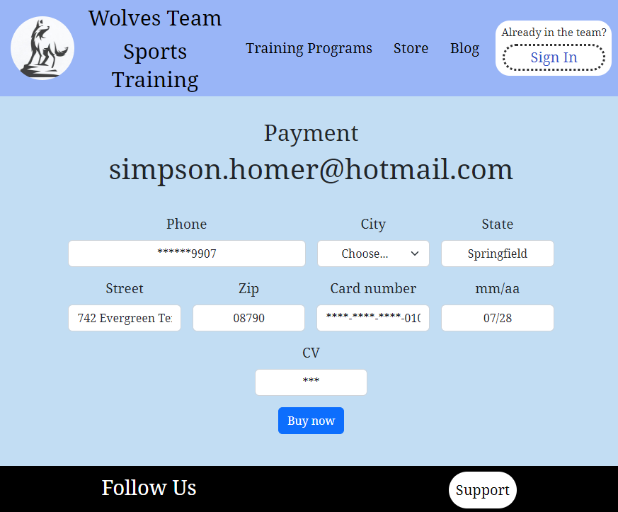
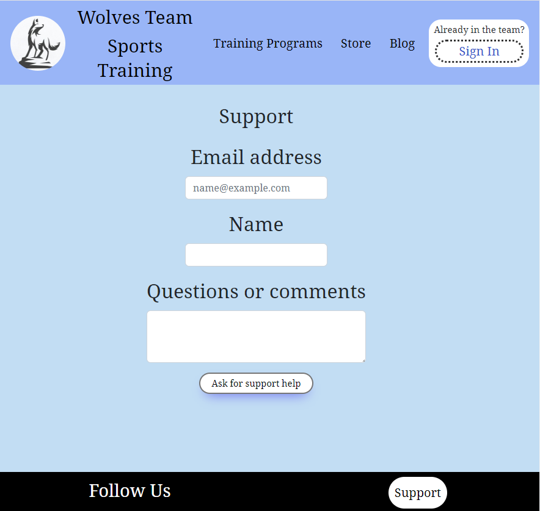
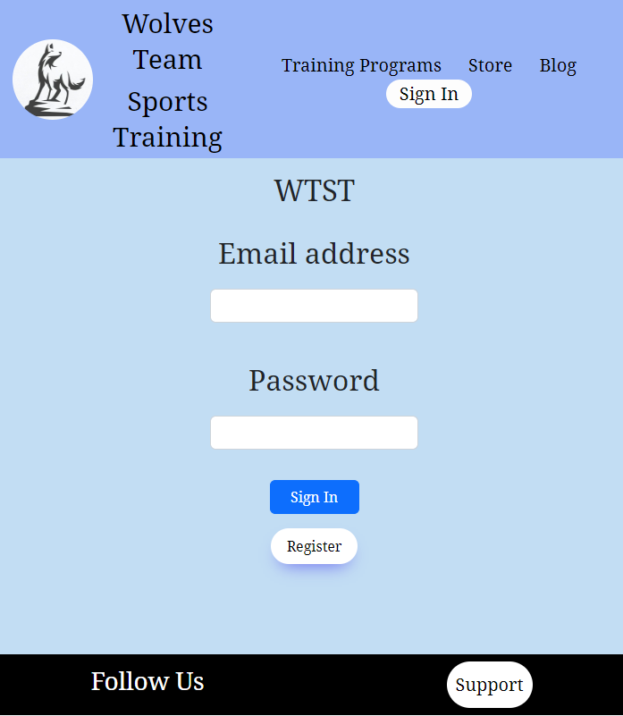
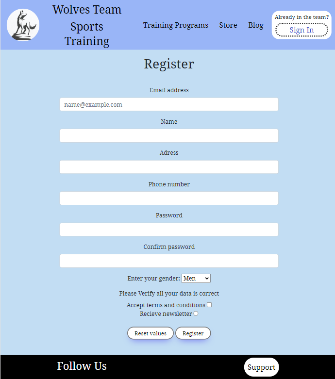

# Wolves Team Sports Training

WTST was my second coding project

 It was based on the structure of an online training webpage.

 One of the things I worked the most with this project was about responsive design and the usage of spaces and colors to point a specific market idea.

 The tool I really enojyed learning and using was SASS or SCSS because the way you structure contents in order to have a specific organisation of your contents is really usefull to get elements divided and makes it easier to work with partials.

 
     
      
     
    

    
## Project views

## Things learnt and used with this project

- HTML

- CSS

- SCSS

- Media queries

- Responsive design

- Mixins

- Variables in SCSS

- Bootstrap library

- FlexBox

- Grid

- GitHub Pages

- Git branching, merging and deploying

- Git

- Basic Ux 

- JavaScript

- SweetAlertJS library
